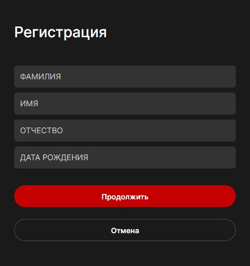
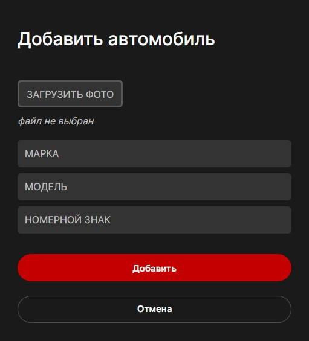
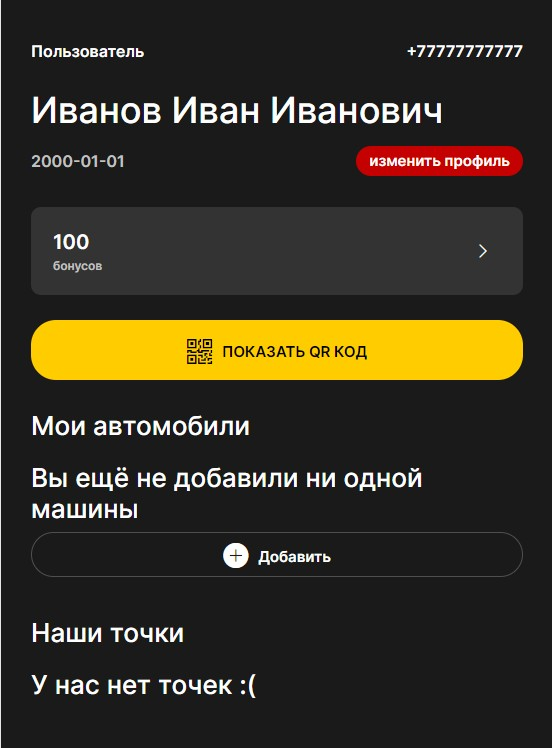
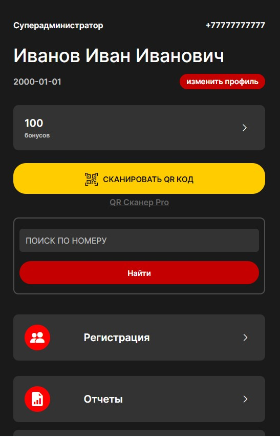
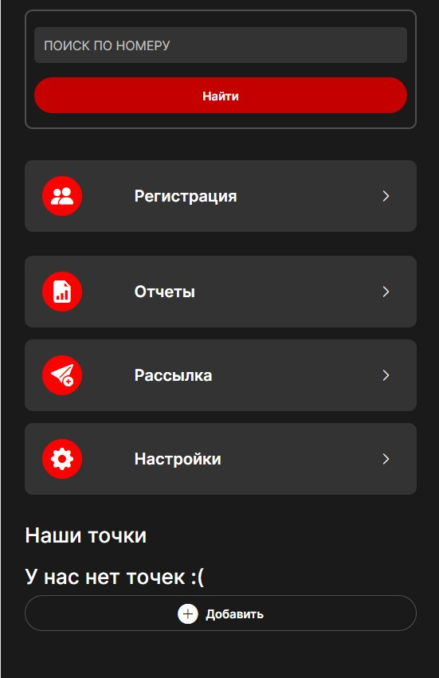

# Bot Avaprodetailing

## Команда
- Дмитрий Беликов - [monter220](https://github.com/monter220)
- Сергей Иванов - [isv160179](https://github.com/isv160179)
- Сергей Филатов - [Serhioth](https://github.com/Serhioth)
- Сергей Колтыгин - [cmipro](https://github.com/cmipro)
- Александр Лаврушенков - [lavralex](https://github.com/lavralex)

## Описание
Проект представляет собой телеграм бот для сети автомоек с возможностью регистрации клиентов, формирования заказов и оплаты, также реализована система лояльности и отчетности.
### Возможности пользователей:
***Регистрация по номеру телефона с заполнением данных:***

 

***Добавление автомобиля:***



***В меню личного кабинета можно посмотреть бонусы, мой автомобиль, есть возможность добавить или отредактировать марку, модель и гос. номер автомобиля***



***Админ часть: наполнение каталога услуг с возможностью редактирования, Отчеты по выбранному клиенту (заказы, начисления и списание бонусов), общий отчет по дням, отчет по клиентам. Рассылка новостей клиентам.***

 

***Также реализовано получение приветственных бонусов и бонусов от каждой оплаченной услуги, и онлайн оплата из бота с помощью QRcode.***

## Инструкция по запуску.
### Локально:
1) Клонировать проект себе

    `git clon git@github.com:Studio-Yandex-Practicum/avaprodetailing_bot_3.git`

2) Перейти в дерикторию проекта

    `cd avaprodetailing_bot_3/`

3) В активированном виртуальном окружении установить зависимости

    `pip install -r requirements.txt`

4) Создать файл .env по примеру .env.template
5) Создать папку versions в alembic/

   `mkdir alembic/versions`

6) создать и применить миграции

   ```
   alembic revision --autogenerate -m "first migration"
   alembic upgrade head
   ```

7) Запустить проект
   
   `uvicorn app.main:app --reload`

### Удаленный сервер:
    ```
    cd /home/team3/avaprodetailing_bot_3
    docker compose up
    ```

## Используемые технологии:
### Основные технологии
- [python](https://www.python.org/)
- [fastapi](https://fastapi.tiangolo.com/)
- [pydantic](https://pydantic-docs.helpmanual.io/)
- [aiogram](https://aiogram.dev/)
- [alembic](https://alembic.sqlalchemy.org/en/latest/)
- [SQLAlchemy](https://www.sqlalchemy.org/)
- [redis](https://redis.io/)
- [uvicorn](https://www.uvicorn.org/)
- [openpyxl](https://openpyxl.readthedocs.io/en/stable/)
- [Jinja2](https://jinja.palletsprojects.com/en/3.0.x/)
- [javaScript](https://developer.mozilla.org/en-US/docs/Web/JavaScript)
- [html5](https://developer.mozilla.org/en-US/docs/Web/Guide/HTML/HTML5)
- [css](https://www.w3.org/Style/CSS/)

  
### Дополнительные библиотеки
- [gosnomer](https://pypi.org/project/gosnomer/)
- [phonenumbers](https://pypi.org/project/phonenumbers/)
  
